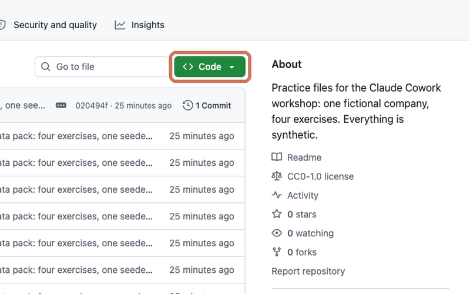
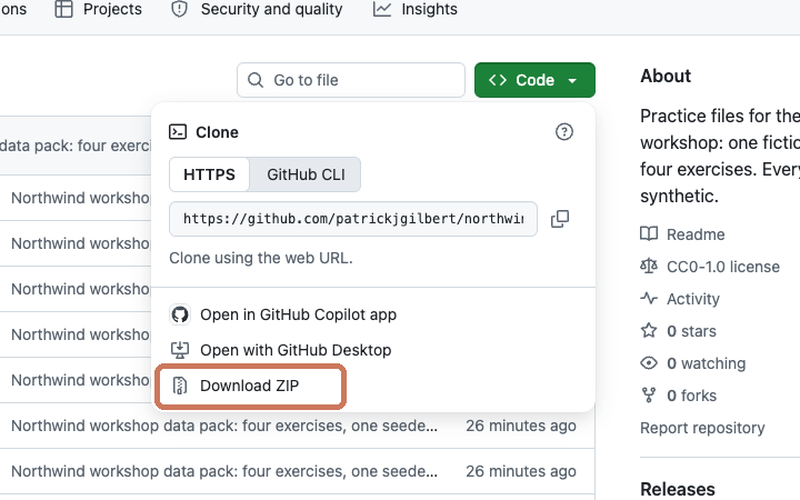
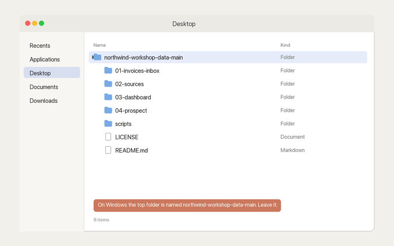

# Northwind workshop data: practice files for Claude Cowork

Practice files for the "Claude Cowork for Beginners" workshop. One fictional company, four exercises. Every file in this repository is synthetic: the company, the people, the customers, the vendors, the emails, the dollar figures. Any resemblance to a real business or person is a coincidence. The whole pack is released under CC0 (public domain), so use it however you like.

## The company

Northwind Home Services is a residential cleaning and handyman business in Portland, Maine, run by an owner named Dana Whitfield. Over the last two years Dana added a light-commercial cleaning line (condo associations, dental and medical offices, restaurants, property managers), and that line now brings in most of the roughly $2.8 million the company invoices a year. In the exercises, you play Dana.

## How to get the files

1. Click the green **Code** button near the top of this page.

   

2. Choose **Download ZIP**.

   

3. Unzip it (double-click on a Mac; right-click and choose Extract All on Windows) and drag the folder to your Desktop.

   

**Windows note:** the folder unzips as `northwind-workshop-data-main`, not `northwind-workshop-data`. That is normal. Open that folder when Cowork asks you to pick one.

## The four exercises

Each folder has its own README with the exact prompts to paste, a "What's planted" section so you can check Claude's answer against the truth, and a context file: a short page of rules or background that the prompt tells Claude to read first.

| Folder | Exercise | Context file | Model | What you will get |
|---|---|---|---|---|
| `01-invoices-inbox/` | Clean up a messy vendor invoice inbox: read every file, rename, sort into category and vendor folders, build a ledger | `rules.md`: how Northwind categorizes and names vendor files | Sonnet 5.5 | Renamed files in category folders, `_receipts/`, `_review/`, `ledger.csv`, `MOVES.md` |
| `02-sources/` | Reconcile what Northwind promised customers in Q3 2026 against what it invoiced, across Gmail, Slack, a meeting transcript, QuickBooks, HubSpot and the scheduling export | `rules.md`: how Northwind works with data (calculate, cite, stop and ask) | Opus 5.5 | `northwind-q3-reconciliation.xlsx` with formulas, then a formatted version |
| `03-dashboard/` | Turn 30 months of revenue by customer and service line into an offline HTML dashboard, first generic, then on brand | `brand-guidelines.md`: Northwind's colors, fonts, layout and chart rules (second pass only) | Opus 5.5 | `northwind-dashboard.html`, then `northwind-dashboard-branded.html` |
| `04-prospect/` | Prepare for a second sales call using only the pages, email and notes in the folder | `northwind-company-profile.md`: who Northwind is, what it sells and how it prices | Opus 5.5 | `lakeshore-call-prep.md`, graded and revised |

Do them in order if you can. Exercise 2 pays off the duplicate invoice you will meet in exercise 1, and the planted findings in exercise 3 are the same customers you met in exercise 2.

Every prompt says "Reference [the file] and follow those rules exactly as written" (or "for who we are and what we sell"). That one line is the difference between Claude doing the task its own way and doing it your way. The context file holds what does not change from run to run, so the prompt only has to say what you want this time.

## Then make each one a skill

After each exercise, in the same session, paste the skills prompt from that folder's README ("Wait. I might have to do this again."). Claude turns the session, with the context file folded in, into a one-file skill you can run from one line next month, in any folder. The four skills are `invoice-inbox`, `quarterly-reconciliation`, `monthly-dashboard` and `call-prep`.

## Use your own files instead

Nothing here depends on this company. If you have a real inbox of vendor invoices, a real set of exports, a real revenue spreadsheet or a real prospect, point Cowork at that folder and paste the same prompt. The prompts are written so the folder, not the prompt, carries the specifics. Copy the context file in too and edit it to match how your business works: your categories, your definitions, your brand, your company. Start with a copy of your files, not the originals, and keep the "do not delete anything" and "one pass, then stop" lines; they are what make the first run safe to watch.

## How to regenerate

Folders `01`, `02` and `03` (and the one email in `04`) are produced by a single seeded script from one model, so the numbers tie out across folders. The web-page PDFs and call notes in `04` are also written by the script from text in `scripts/content.py`. To rebuild everything:

```bash
uv run --with openpyxl --with fpdf2 --with pillow python3 scripts/generate.py
uv run --with openpyxl --with fpdf2 --with pillow python3 scripts/qa_check.py
```

`generate.py` prints every planted number as it runs. `qa_check.py` asserts every planted fact and every tie-out (and that every invoice PDF extracts cleanly with `pdftotext`, which it needs installed) and exits non-zero if anything is off. The README files and the four context files (`rules.md` in `01` and `02`, `brand-guidelines.md` in `03`, `northwind-company-profile.md` in `04`) are written by hand; the generator never deletes them.

## License

CC0 1.0 Universal. See `LICENSE`. No attribution required.
